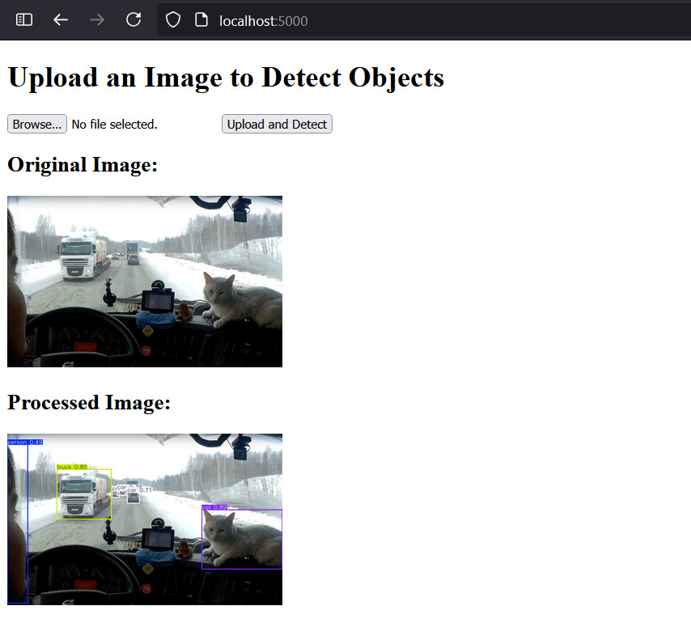
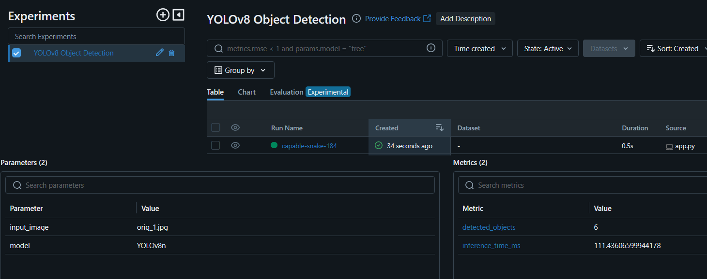

Запустить проект
```bash
docker compose up --build
```

Поиск объектов на картинке — [link]("http://localhost:5000").



MLflow UI — [link]("http://localhost:5001").




MLFlow помогает с трекингом экспериментов, например, если позже перейти на другую модель, можно будет сравивать результаты детекций разных моделей. Сохраняются все обработанные изображения, в случае ошибки можно найти конкретный эксперимент.